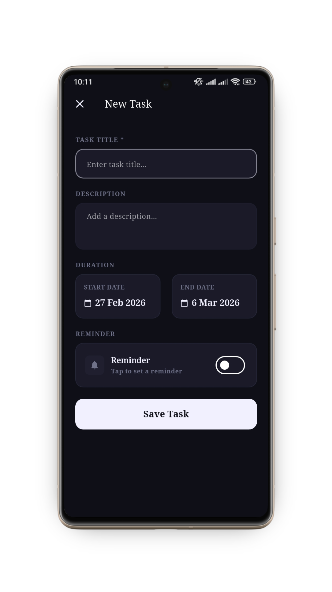
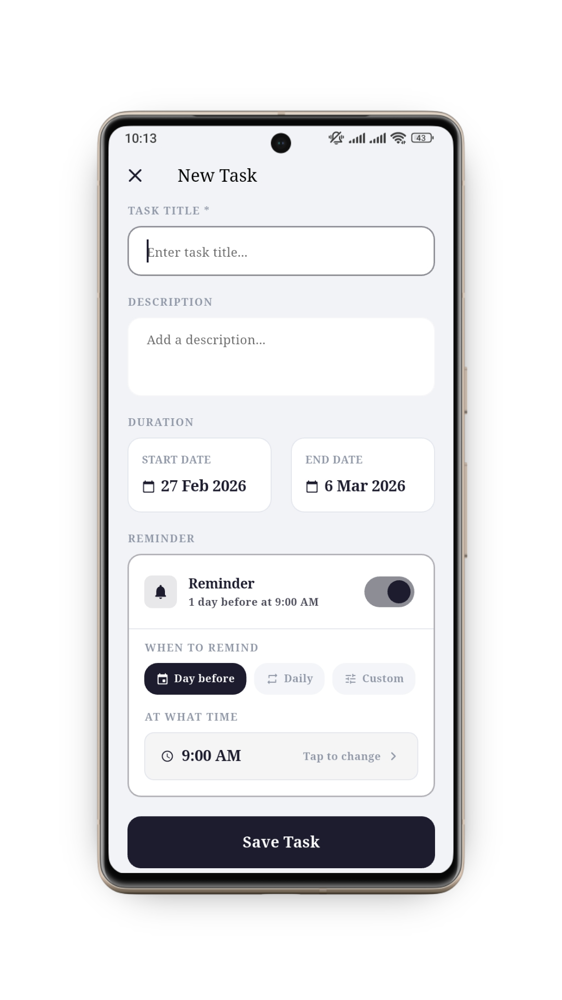
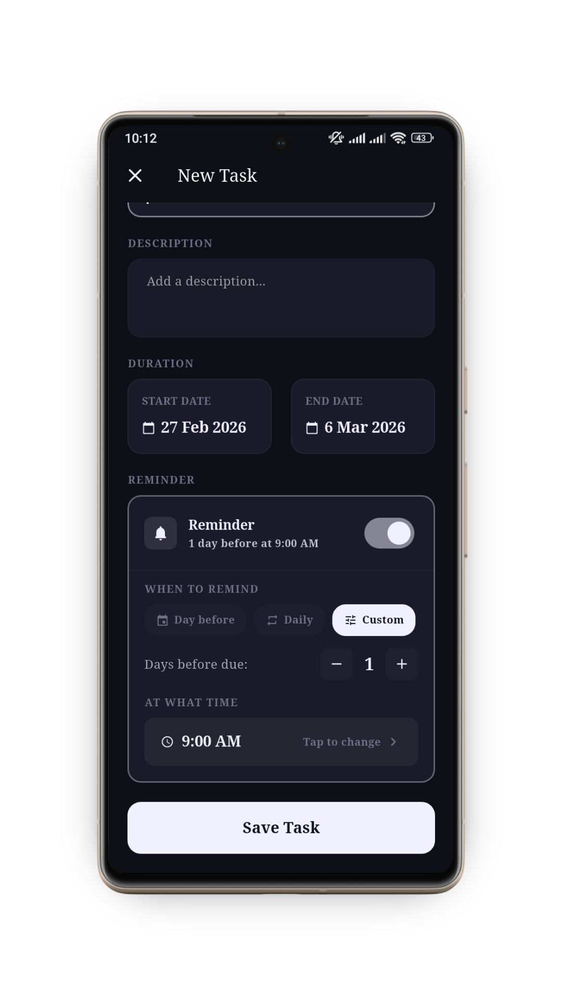

# Trak

A Flutter productivity app for task management and habit tracking in one place.

Built with `provider` for state management, local persistence, smart reminders, Android home screen widgets, and light/dark theming.


-3DDC84?style=flat-square&logo=android&logoColor=white)

> [!IMPORTANT]
> The codebase includes Android and iOS targets, but the app has only been tested on Android so far.

## Preview

<!-- markdownlint-disable MD033 -->
| | |
| :---: | :---: |
| **Add Task (Dark)** | **Add Task (Light)** |
|  |  |
| **Reminder System** | |
|  | |
<!-- markdownlint-enable MD033 -->

## Features

### Task Management

- Create tasks with title, optional description, and a date range
- Task detail screen with progress, due-date info, and complete action
- Overdue detection for unfinished tasks
- Sort tasks by start date, end date, created date, or overdue first
- All / Active / Completed task tabs
- Swipe to complete or delete tasks

### Habit Tracker

- Create daily goals/trackers with title, optional description, and reminder time
- Tracker detail screen with connected calendar and streak visualization
- Swipeable monthly calendar
- 7-day strip on tracker cards
- Current streak and completion stats
- Sort trackers by newest, highest streak, or completion rate
- Swipe to delete trackers

### Notifications

- Tasks support 4 reminder modes: on due day, day before, daily, and custom X days before
- Trackers support a daily reminder at a chosen time
- Creation confirmation notification a few seconds after save
- Notifications are cancelled when related items are deleted, completed, or archived as applicable

### Android Widgets

- Task widget shows active task title and due date
- Tracker widget shows title, today's status, and streak
- Both widgets support previous/next navigation
- Widgets refresh immediately after in-app changes through a `MethodChannel`

### UI

- Light and dark theme toggle
- Color-coded cards
- Splash screen
- Shared animated header
- PageView-based navigation between Tasks and Tracker sections

## Architecture

```text
lib/
|-- main.dart                        # App entry point, provider setup, theme loading, notification initialization
|-- models/
|   |-- task.dart                    # Task data model, reminder mode enum, JSON serialization, task helpers
|   `-- tracker.dart                 # Tracker data model, archive state, streak and completion helpers
|-- providers/
|   |-- task_provider.dart           # Task CRUD, sorting, persistence, notifications, widget refresh
|   `-- tracker_provider.dart        # Tracker CRUD, archive flow, persistence, notifications, widget refresh
|-- screens/
|   |-- splash_screen.dart           # Startup screen and transition into the main app
|   |-- main_screen.dart             # Root shell with shared header, page navigation, sort actions, add actions
|   |-- home_screen.dart             # Task dashboard with All, Active, and Completed tabs
|   |-- tracker_screen.dart          # Tracker list screen with sorting, loading, and empty states
|   |-- task_detail_screen.dart      # Full task details, progress UI, reminder info, edit/complete actions
|   |-- tracker_detail_screen.dart   # Full tracker details, calendar view, streaks, history, edit actions
|   |-- add_task_screen.dart         # Form for creating tasks with dates and reminder configuration
|   |-- edit_task_screen.dart        # Form for editing task details, dates, and reminder settings
|   |-- add_tracker_screen.dart      # Form for creating trackers/goals with optional daily reminder
|   `-- edit_tracker_screen.dart     # Form for editing tracker details and reminder time
|-- services/
|   |-- notification_service.dart    # Local notification setup, permission requests, task/tracker scheduling
|   `-- storage_service.dart         # SharedPreferences persistence helpers for tasks and trackers
|-- utils/
|   |-- app_theme.dart               # Themes, colors, spacing, sizes, radii, theme mode storage
|   `-- date_helper.dart             # Shared date formatting and date utility helpers
`-- widgets/
    |-- task_card.dart               # Task list card with swipe actions, badges, and summary info
    |-- tracker_card.dart            # Tracker list card with streak preview and swipe interactions
    `-- reminder_section.dart        # Reusable reminder selection UI for task add/edit screens

android/app/src/main/
|-- kotlin/.../
|   |-- MainActivity.kt              # Native Flutter host and MethodChannel bridge for widget refresh
|   |-- TaskWidgetProvider.kt        # Android home screen widget provider for active tasks
|   `-- TrackerWidgetProvider.kt     # Android home screen widget provider for trackers and streak status
`-- res/
    |-- layout/
    |   |-- task_widget.xml          # RemoteViews layout used by the task widget
    |   `-- tracker_widget.xml       # RemoteViews layout used by the tracker widget
    |-- xml/
    |   |-- task_widget_info.xml     # Task widget metadata, sizing, and launcher configuration
    |   `-- tracker_widget_info.xml  # Tracker widget metadata, sizing, and launcher configuration
    `-- drawable/
        |-- circle_transparent.xml   # Transparent circular shape used in widget UI elements
        |-- ic_chevron_left.xml      # Left navigation icon used by widgets
        |-- ic_chevron_right.xml     # Right navigation icon used by widgets
        |-- ic_notification.xml      # Notification small icon resource
        |-- launch_background.xml    # Android launch/splash background drawable
        `-- widget_background.xml    # Rounded background drawable used by home screen widgets
```

## Getting Started

### Prerequisites

- Flutter `3.38.6`
- Dart `3.10.7`
- Android Studio or VS Code
- Android device or emulator, Android 6.0+ / API 23+

### Installation

#### 1. Clone the repo

```bash
git clone https://github.com/sabihaniaz7/taskmanager-tracker-flutter.git
cd taskmanager-tracker-flutter
```

#### 2. Install dependencies

```bash
flutter pub get
```

#### 3. Run the app

```bash
flutter run
```

## Dependencies

| Package | Version | Purpose |
| --- | --- | --- |
| `provider` | ^6.1.5+1 | State management |
| `shared_preferences` | ^2.5.4 | Local data persistence |
| `flutter_local_notifications` | ^20.1.0 | Scheduled notifications |
| `flutter_timezone` | ^5.0.1 | Device timezone detection |
| `timezone` | ^0.10.1 | Timezone-aware scheduling |
| `uuid` | ^4.5.3 | Unique IDs |
| `intl` | ^0.20.2 | Date formatting |
| `cupertino_icons` | ^1.0.8 | iOS-style icons |

## Notifications and Permissions

The app initializes local notifications and requests notification permission contextually when reminders are enabled.

Android-specific notes:

- `POST_NOTIFICATIONS` is required on supported Android versions
- Exact alarm permissions are requested for precise scheduling
- Widgets are Android-only

Relevant files:

- `lib/services/notification_service.dart`
- `android/app/src/main/AndroidManifest.xml`

## Development

Local checks:

```bash
flutter pub get
flutter analyze
flutter test
```

## Known Limitations

- The app has only been tested on Android
- Android home screen widgets are not supported on iOS in this project
- Notification behavior may vary by device vendor, battery optimization settings, and OS alarm restrictions

## Design System

Most design tokens live in `lib/utils/app_theme.dart`, including colors, spacing, radii, and theme definitions.

## Built With

- [Flutter](https://flutter.dev)
- [flutter_local_notifications](https://pub.dev/packages/flutter_local_notifications)
- [provider](https://pub.dev/packages/provider)
